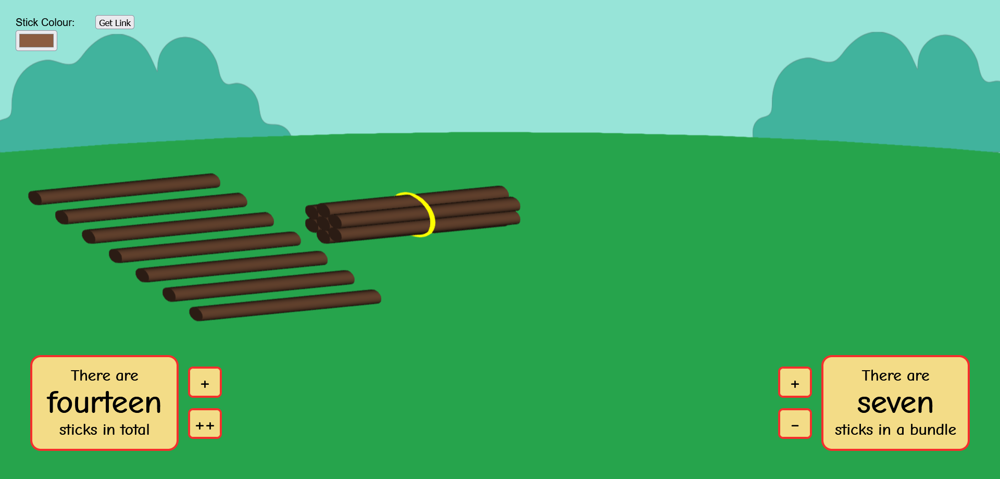

# E-Concrete Manipulatives
> A customisable tool/website for teaching children about number bases.

E-Concrete Manipulatives is a web-based interactive environment in which sticks can be moved around and bundled together. These bundles can then also be moved around and bundled with other bundles. The intention of this environment is for it to be used in classrooms to help teach people about place value in numbers. Students would be using the app in the classroom, following along with a lesson plan lead by a teacher, and answering questions as they go.


## Getting Started
### Prerequisties 
nodeJS:
https://nodejs.org/en/download/

### Installing
Clone repository and cd into directory. \
Install the required packages using npm:
```
npm install
```
Run the server on local machine:
```
npm run dev
```
The site will be running at http://localhost:3000/.

### Live Site
Alternatively, if you just want to use the application, it is live at
http://e-concrete-manipulatives.surge.sh/

# How it works
NodeJS is used to run NPM to manage dependencies.
The app is bundled using Vite and Vite's development server is used for local testing with hot-loading whenever a change is made

## Running Tests
Unit tests can be run with the command
```
npm run test
```

## Deployment
Deployment is done using Surge, and is integrated into the CI/CD pipeline.
Whenever changes are merged / pushed to branch deployment, surge is used to update the live site.

## Usage
For examples and usage please refer to the Wiki.

## Authors / Contact
- Jake Lawrence 2469097L@student.gla.ac.uk
- Ada Fuge 2440986F@student.gla.ac.uk
- Claire Williamson 2464406W@student.gla.ac.uk
- Mahnoor Qureshi 2454285Q@student.gla.ac.uk
- Tanisha Sarkar 2424417S@student.gla.ac.uk


## License
This project is licensed under the GNU General Public License v3.0 - see `LICENSE.md` file for details.
